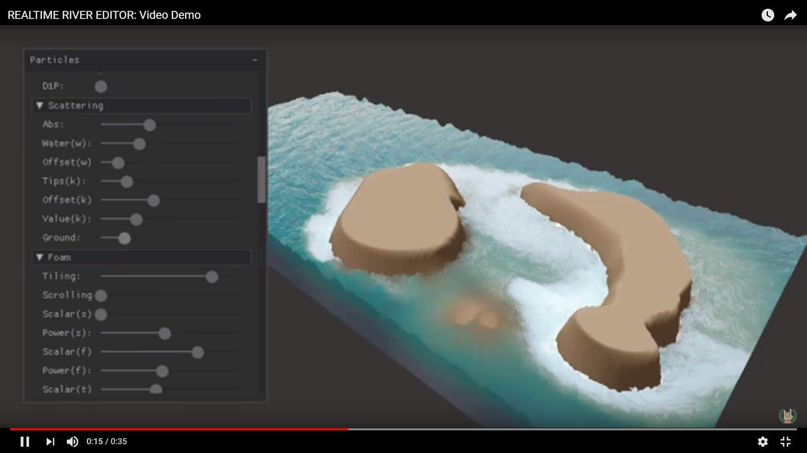
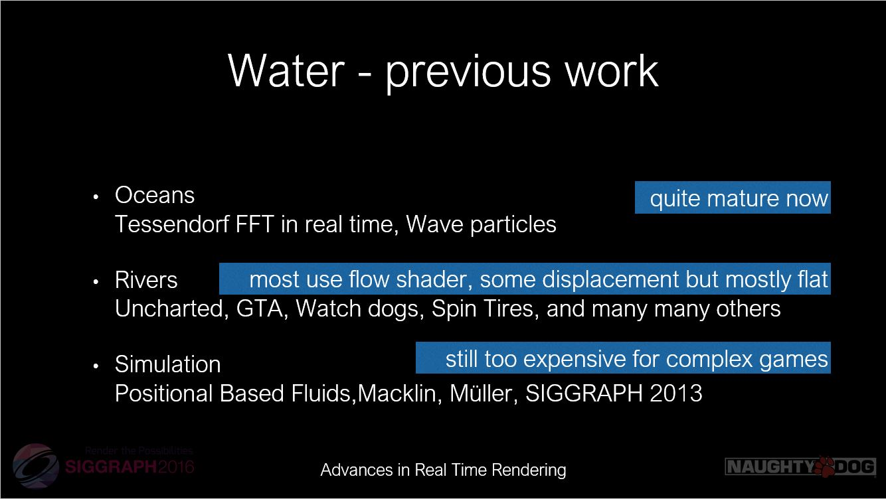
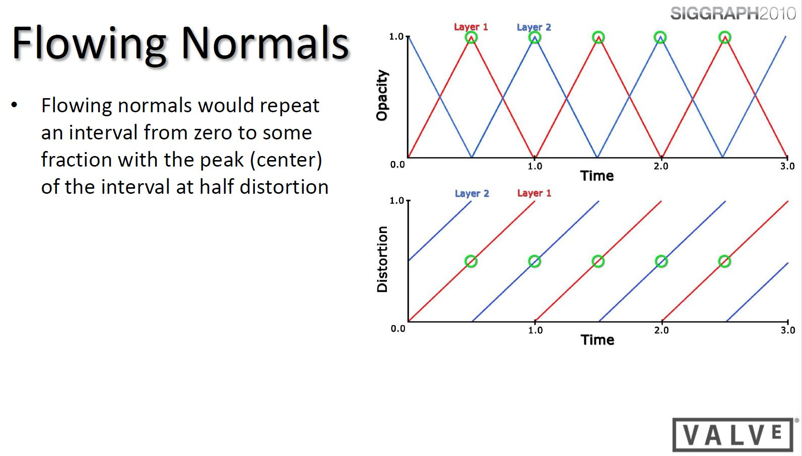

Wave Particles with Interactive Vortices
========================

## Overview 

In game industry water can be divided into two domains: ocean and river. This project focuses on river. Not too long ago, a demo of [a real-time river editor](https://80.lv/articles/river-editor-water-simulation-in-real-time/) was developed by graphics programmer [Jean-Philippe Grenier](http://jpgrenier.org/) from Ubisoft. We think what he did is awesome and want to replicate it (as possible as we can).

Traditionally, rivers are rendered using flow maps. Flow maps are generated by fluid simulations or created by artist or even both. Flow maps are used for advection of water properties such as normal and uv. This technique can give the river a deterministic fluid look, but it fails to capture the sense of height compared with the less controlled ocean rendering techniques, which basically stack several noise functions together to generate the waves. Stacking noise functions together only works for ocean because the ocean does not flow. When you want the water both flow and have the sense of height, a new method should be used.

###### (picture from Rendering rapids in Uncharted 4 by Carlos Gonzalez-Ochoa, Siggraph 2016 Advances in Real-Time Rendering in Games course)

The new method is [Wave Particles](http://www.cemyuksel.com/research/waveparticles/waveparticles_sketch_slides.pdf). Initially, Wave Particles were introduced into the real time water rendering by [Naughty Dog for Uncharted 3](https://www.gdcvault.com/play/1015309/Water-Technology-of) to simulate local high frequency wave of oceans. Then it was adopted and adapted to render rivers by [Naughty Dog for Uncharted 4](http://advances.realtimerendering.com/s2016/s16_ramy_final.pptx) paired with stacking technique.

The significance of the Jean-Philippe Grenier's work is that it generates flow map in real-time. That is why the user can interactively create rocks to block the river and affect the flow of river as we can see in the video. When performing advection on height and normal, previous implementations from Naughty Dog or [Valve](http://advances.realtimerendering.com/s2010/Vlachos-Waterflow(SIGGRAPH%202010%20Advanced%20RealTime%20Rendering%20Course).pdf) use noise and blending techniques to minimize repetition and pulsing caused by advection of a finite sized texture. 

But in this demo the developer used a new technique called [Wave Profile Buffer](http://pub.ist.ac.at/group_wojtan/projects/2018_Jeschke_WaterSurfaceWavelets/WaterSurfaceWavelets.pdf) to solve the repetition and pulsing.

## Goals

* Simple wave particle rendering.

* Combine wave particle with flow map.

* Update flow map in real-time.

* Identify and solve the problems caused by advection of height, uv, normal. (extra features)

## Milestones

- [ ] Milestone 1

  - [ ] DX12 frame work
  
    - [ ] Compute shader

    - [ ] Tessellation shader

    - [ ] Basic Interaction

    - [ ] Basic UI

  - [ ] Basic wave particle rendering

    - [ ] Single particle

- [ ] Milestone 2

  - [ ] Advanced wave particle rendering

    - [ ] Multiple particles

    - [ ] Particle boundary interaction

    - [ ] User interaction (create bump or dent) 

  - [ ] Combine flow map with wave particle

    - [ ] Find some interesting flow maps

    - [ ] Use flow map to advect wave particle

  - [ ] Improve rendering method

    - [ ] Foam

    - [ ] Subsurface scattering

- [ ] Milestone 3

  - [ ] Update flow map in real-time

    - [ ] Fluid simulation

    - [ ] Create blockers (rocks and etc.)

    - [ ] Advect properties using simulation result

- [ ] Final

  - [ ] Finish unfinished work

  - [ ] Identify and solve the problems caused by advection of height, uv, normal

## References

[River Editor Water Simulation in Real-Time](https://80.lv/articles/river-editor-water-simulation-in-real-time/)

[Wave Particles Slides](http://www.cemyuksel.com/research/waveparticles/waveparticles_sketch_slides.pdf)

[Wave Particles Paper](http://www.cemyuksel.com/research/waveparticles/cem_yuksel_dissertation.pdf)

[Water Surface Wavelets](http://pub.ist.ac.at/group_wojtan/projects/2018_Jeschke_WaterSurfaceWavelets/WaterSurfaceWavelets.pdf)

[Uncharted 3 Ocean Rendering](https://www.gdcvault.com/play/1015309/Water-Technology-of)

[Uncharted 4 River Rendering](http://advances.realtimerendering.com/s2016/s16_ramy_final.pptx)

[Valve Flow Map](http://advances.realtimerendering.com/s2010/Vlachos-Waterflow(SIGGRAPH%202010%20Advanced%20RealTime%20Rendering%20Course).pdf)

[A 2D Fluid Solver](https://prideout.net/blog/old/blog/index.html@p=58.html)

[GPU Gems: Fast Fluid Dynamics Simulation on the GPU](https://developer.nvidia.com/gpugems/GPUGems/gpugems_ch38.html)

[A Similar Workflow](https://pdfs.semanticscholar.org/f548/cc7476e2e7e53b42befa19a376b61d12c7e9.pdf)
